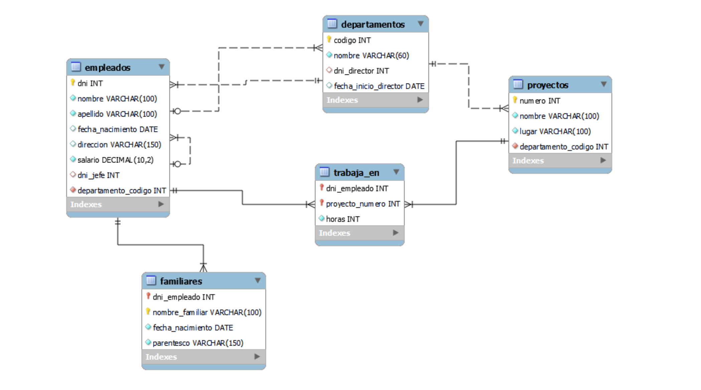

# sql-database-projects
Proyecto integrador de SQL que modela la base de datos de una empresa (Digital Solutions),
incluyendo empleados, departamentos, proyectos y familiares.

-- Modelo de datos
La base de datos contempla:
- Empleados y su jerarquía (jefes)
- Departamentos y directores
- Proyectos supervisados por departamentos
- Asignación de empleados a proyectos
- Registro de familiares de empleados

-- Archivos del proyecto
- tablas.sql → creación de tablas y relaciones
- inserts.sql → carga de datos iniciales
- updates.sql → asignación de directores
- consultas.sql → consultas solicitadas

-- Diagrama
## Diagrama Entidad-Relación

-- Tecnologias:
- MySQL
- SQL estándar

## Estado
Proyecto académico finalizado, utilizado como práctica de bases de datos relacionales.
